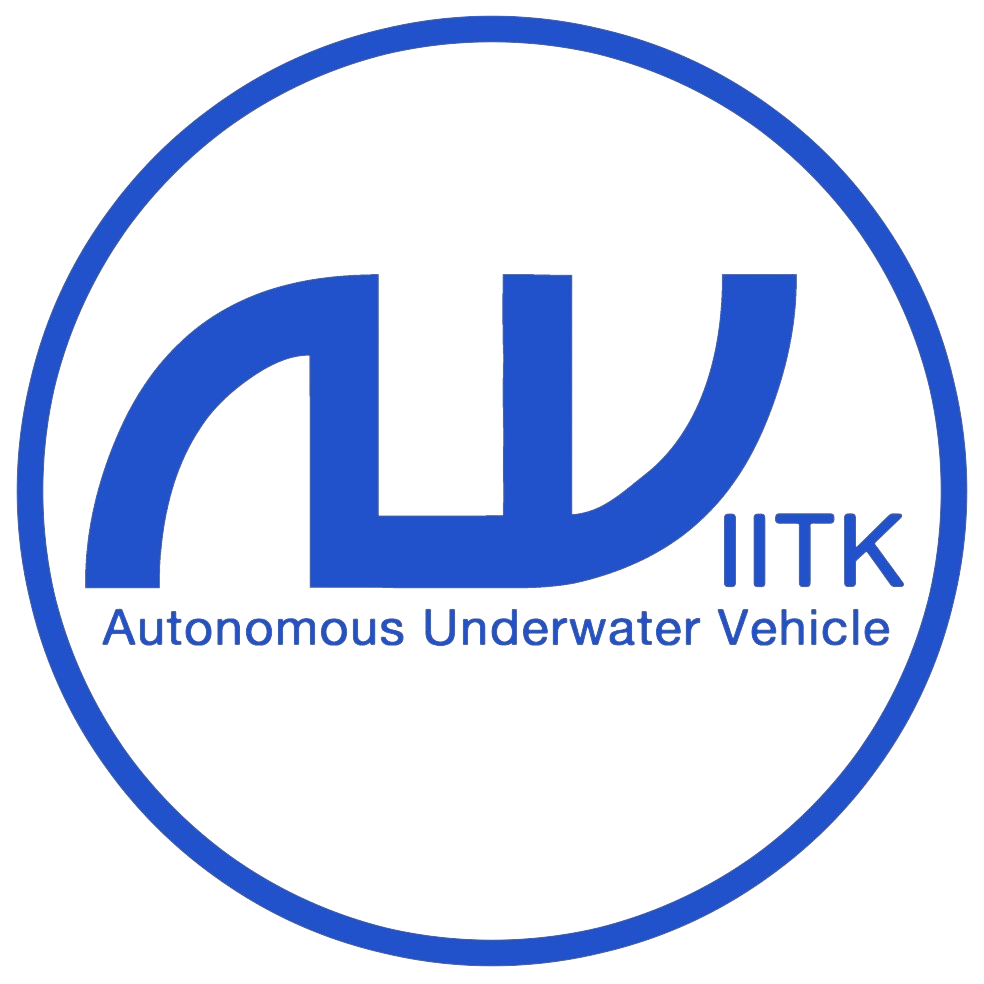

#  Welcome to AUV IITK Overall Documentation

Team <b>AUV IITK</b> ( Autonomous Underwater vehicle, Indian Institute of Technology, Kanpur), from IIT Kanpur, India, is an undergraduate student led team that builds Autonomous Underwater Vehicles (AUVs) to perform at various international competitions and perform cutting edge Research .

Since our beginning in 2014, the Team has expanded quite a lot with more than 30 active members and an active alumni network. We have come a far away in technological advancement since our beginning.

We love to share our idea and develop great collaboration with people around the world 😊.

We also love to recieve new ideas, suggestions and guidance from different teams around the globe 😄.

The code is open source, and available on Github.
<!-- [] -->

This documentation is organized into a couple section:

- [User Documentation](#user)
- [Software Documentation](#software)
- [Electrical Documentation](#electrical)
- [Mechanical Documentation](#mechanical)
- [Proof of Concept](#POC)
- [About S.O.N.I.A.](#about)

## User Documentation 

- [Getting Started](user/getting_started.md)
- [Installation](user/installation.md)
- [Developers Guide](user/developers_guide.md)
<!-- - [Environment](user/environment.md) -->

<!-- ## Server Documentation 

- [Getting started](server/getting_started.md)
- [Installation](server/installation.md)
- [Orchestration](server/orchestrxation.md) -->

## Software Documentation 

- [Overview](software/overview.md)
- [DVL](software/dvl.md)
- [IMU](software/imu.md)
- [Vision](software/vision.md)
<!-- - [Navigation](software/navigation.md) -->

## Electrical Documentation 

- [Overview](electrical/overview.md)
- [Hydrophones](electrical/hydrophones.md)
- [DVL](electrical/dvl.md)

## Mechanical Documentation 

- [Overview](mechanical/overview.md)

## About AUV IITK. 

- [The Project](about/project.md)
- [Open Source Philosophy](about/open_source.md)
- [Sponsors of AUV IITK](about/sponsors.md)
